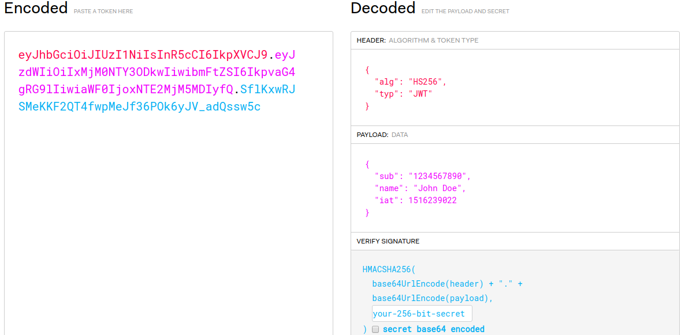
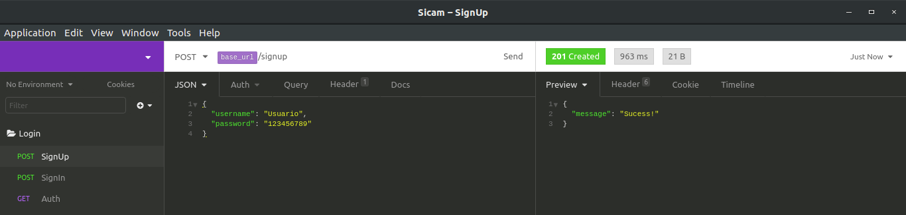
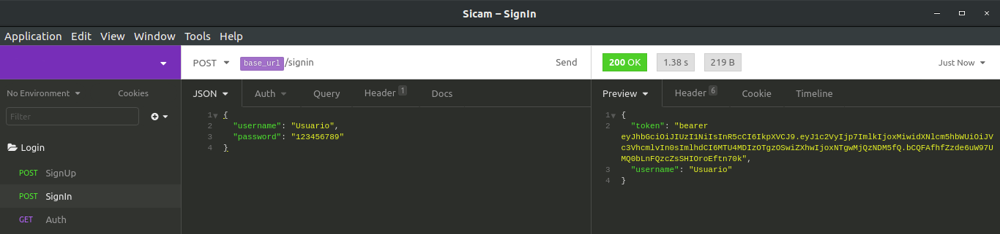
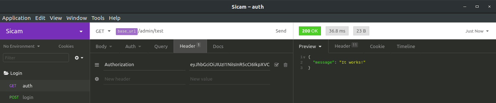

# Autenticação JWT

Como podemos autenticar nossos usuários afim de que algumas páginas sejam restritas e outras sejam públicas?
Uma solução para tal problema pode ser a autenticação JWT!

##### O que significa JWT?

  - JSON
  - WEB
  - TOKEN

##### Como funciona a autenticação JWT?
O funcionamento é bastante simples: 
1. O usuário envia no corpo da requisição o email e senha.
2. O servidor fará uma pesquisa no banco procurando pelo email informado.
3. Caso o email informado não seja encontrado, será retornado algum erro.
4. Caso o email informado seja encontrado, então as senhas serão comparadas.
5. Caso as senhas coincidam, será gerado um token de autenticação contendo algumas informações não senssíveis do usuário.
6. Esse token será devolvido ao front-end, que por sua vez o armazenará no localStorage.
7. A partir de agora, o token será enviado no header de toda requisição feita ao servidor.
8. O servidor por sua vez terá o papel de verificar se aquele token é valido e decidir se permitirá que o usuário continue navegando ou não.

:heavy_check_mark: Vale lembrar que o token em questão pode ou não ter uma data para expirar.

##### É possível descriptografar o token e ter acesso as informações contidas nele?
:unlock: O token em si não é criptografado, você pode visualizar as informações contidas nele acessando: https://jwt.io/



:key: Mas existe uma chave de assinatura contida no servidor, essa chave serve para assinar o token, de modo que se alguém tentar enviar um token falsificado, o servidor terá como verificar que aquele token não é verídico.

# Principais dependências
  - Passport
    - O Passport é um middleware de autenticação para o Node . Ele foi projetado para servir a um propósito único: autenticar solicitações. 
  - Passport-local
    - Estratégia de passaporte para autenticação com nome de usuário e senha.
  - Passport-jwt
    - Uma estratégia do Passport para autenticação com um JSON Web Token. 
  - Jsonwebtoken
    - Biblioteca utilizada para gerar, verificar, decodificar o token.
  - Bcrypt
    - Biblioteca utilizada para criptografar as senhas do banco
  - JOI
    - Biblioteca utilizada para fazer validações

:warning: NOTA: A biblioteca Bcrypt, JOI, dotEnv e Convict não são exatamente necessárias para a implementação da autenticação JWT em si, mas são importantes, seguindo exatamente essa estrutura de API, o projeto poderá ser fácilmente adaptado para ser lançado em produção, ele é minimalista com enfase em demonstrar o JWT, mas também contem algumas boas práticas de organização e segurança. 

##### Comando para iniciar o projeto:

```sh
$ npm start
```
##### A onde tudo começa:
O projeto está dividido em uma sequencia lógica de três modulos:
1. SignUp (Registro de usuário)
2. SignIn (Login de usuário)
3. Dashboard (Disponível apenas a usuários autenticados)

Tudo começa com o registro de um usuário:


Depois disso, podemos logar com usuário e senha:


Como podemos observar, o usuário dispara uma requisição para o servidor enviando usuário e senha, antes desses dados serem entregues ao controller, eles passam por um middlware:
```js
router.post('/', secureLocal, controller.signIn);
```
O secureLocal se refere a isso, que está sendo exportado de Auth:
```js
const secureLocal = passport.authenticate('local', { session: false });
```
Ou seja, estamos falando da estratégia de autenticação local do passport:
```js
// LOCAL STRATEGY
  passport.use(
    new LocalStrategy(async (username, password, done) => {
      // Find the user given the email
      let userModel;
      try {
        userModel = await user.findOne({
          where: { username, isActive: true },
          attributes: ['id', 'username', 'password'],
        });
      } catch (err) {
        return done(null, err);
      }
      // If not, handle it
      if (!userModel) {
        return done(null, false);
      }
      
      // Check if the password is correct
      const userPassword = userModel.get('password');
      const userObj = userModel.get({ plain: true });

      if (!(await bcrypt.compare(password, userPassword))) {
        return done(null, false);
      }
      delete userObj.password;
      return done(null, userObj);
    }),
  );
};
```
Observando esse código, podemos facilmente notar que a unica coisa que ele está fazendo é verificar no banco se existe algum usuário igual ao informado, se sim, então ele utiliza o metodo **compare** do bcrypt para comparar as senhas, em caso de **false** a seguir vem a instrução de retorno do passport.

No caso do usuário e senha realmente baterem, então simplesmente excluímos a senha do objeto usuário e o retornamos:
```js
delete userObj.password;
return done(null, userObj);
```
Após isso, seguindo para o controller, o token será gerado com base no usuário retornado.
```js
signIn: (req, res) => {
    const { user } = req;

    // Generate token
    const token = JWT.sign(
      {
        user,
      },
      config.get('authenticate'), { expiresIn: '1h' } // Expires in 1h
    );

    res.json({ token: `bearer ${token}`, username: user.username });
  },
```
Aqui podemos definir algumas coisas interessantes:
Tempo de duração do token:
```js
{ expiresIn: '1h' } // Expires in 1h
```
SECRET_KEY:
```js
config.get('authenticate')
```
Aqui vale uma breve explicação sobre o SECRET_KEY, que é a chave de assinatura do token conforme já falamos no início deste arquivo, nesse caso armazenamos o SECRET_KEY dentro do arquivo do convict: *src/config.js*.
```js
authenticate: {
    doc: 'This is a key to dealing with tokens',
    format: String,
    default: 'd65sf4-6sd5f4-6vs1v-s65s4x',
    env: 'JWT_SECRET',
  },
```
Fizemos isso pois não é legal que algo tão senssível esteja no meio do código, senão qualquer um que tenha acesso ao código poderia ter acesso ao SECRET_KEY.

Vale lembrar também, que o SECRET_KEY deve ser chamado no arquivo .env para que funcione:
```
NODE_ENV=development
JWT_PORT=3000
JWT_DB_NAME=databaseTest
JWT_DB_USER=userTest
JWT_DB_PASSWORD=#Teste34524519
JWT_DB_DIALECT=mysql
JWT_DB_HOST=127.0.0.1
JWT_DB_PORT=3306
JWT_DB_POOL_MAX=25
JWT_SECRET=d65sf4-6sd5f4-6vs1v-s65s4x
```
**Bearer**: É necessário que o token seja concatenado com o prefixo *Bearer* antes de ser enviado ao front-end, pois o *Bearer* indica que está sendo trafegado um token e não um usuário e senha, que é o caso da flag *Basic*.

Com o token em mãos, o front-end o enviará nos headers das próximas requisições:


O objetivo de enviar o token na requisição é verificar se aquele usuário é autentico e se tem permissão para acessar tal rota.

Novamente tudo começa no arquivo de rotas:
```js
router.get('/', secureJwt, controller.test);
```
Dessa vez utilizamos a estratégica JWT:

```js
// JSON WEB TOKENS STRATEGIES
  passport.use(
    new JwtStrategy(
      {
        jwtFromRequest: ExtractJwt.fromAuthHeaderAsBearerToken('authorization'),
        secretOrKey: config.get('authenticate'),
      },
      async (payload, done) => {
        // Find the user specified in token
        let userModel;
        try {
          userModel = await user.findOne({
            where: { id: payload.id },
          });
        } catch (err) {
          return done(null, err);
        }
        // If user doesn't exists, handle it
        if (!userModel) {
          return done(null, false);
        }
        // Otherwise, return the user
        return done(null, user);
      },
    ),
  );
```
Em caso de sucesso, estamos autenticados e podemos seguir para o controller, ao infinito e além!
```js
 test: async (req, res) => {
    console.log('It works!');
    res.json({ message: 'It works!' });
  },
```
