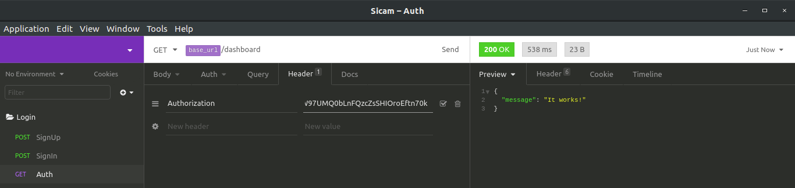

# Autenticação JWT

Como podemos autenticar nossos usuários afim de que algumas páginas sejam restritas e outras sejam públicas?
Uma solução para tal problema pode ser a autenticação JWT!

##### O que significa JWT?

  - JSON
  - WEB
  - TOKEN

##### Como funciona a autenticação JWT?
O funcionamento é bastante simples: 
1. O usuário envia no corpo da requisição o email e senha.
2. O servidor fará uma pesquisa no banco procurando pelo email informado.
3. Caso o email informado não seja encontrado, será retornado algum erro.
4. Caso o email informado seja encontrado, então as senhas serão comparadas.
5. Caso as senhas coincidam, será gerado um token de autenticação contendo algumas informações não senssíveis do usuário.
6. Esse token será devolvido ao front-end, que por sua vez o armazenará no localStorage.
7. A partir de agora, toda requisição ao servidor levará nos headers, o bendito token.
8. O servidor por sua vez terá o papel de verificar se aquele token é valido e decidir se permitirá que o usuário continue navegando ou não.

Vale lembrar que o token em questão pode ou não ter uma data para expirar.

##### É possível descriptografar o token e ter acesso as informações contidas nele?
O token é gerado com base em uma chave criptográfica que fica unica e exclusivamente contida no servidor, de modo que só e somente o servidor tem a chave para descriptografar o token.

# Dependências
  - Passport
    -- O Passport é um middleware de autenticação para o Node . Ele foi projetado para servir a um propósito único: autenticar solicitações. 
  - Passport-local
    -- Estratégia de passaporte para autenticação com nome de usuário e senha.
  - Passport-jwt
   -- Uma estratégia do Passport para autenticação com um JSON Web Token. 
  - Jsonwebtoken
   -- Biblioteca utilizada para gerar, verificar, decodificar o token.
  - Bcrypt
   -- Biblioteca utilizada para criptografar as senhas do banco
  - JOI
   -- Biblioteca utilizada para fazer validações

NOTA: A biblioteca Bcrypt e a biblioteca JOI não são obrigatórias neste caso, mas já que estamos falando de segurança, achei importante criptografar as senhas do banco e fazer a validação dos campos usuário e senha que estão entrando no servidor, não custa nada mesmo. 

##### Instalação das principais bibliotecas:

```sh
$ npm install passport passport-local passport-jwt jsonwebtoken --save
```
##### A onde tudo começa:
Tudo começa em nosso arquivo de rotas:
```js
router.post(
  '/signin',
  validationMiddleware(schemas.login, 'body'),
  passportSignIn,
  controller.signIn,
);
```
Insominia:


Como podemos observar, o usuário dispara uma requisição para o servidor enviando email (ou username) e senha, no nosso exemplo esses dados caem primeiro em um middleware de validação (a biblioteca JOI faz isso), isso não tem a ver com JWT, mas é mais uma medida de segurança antes de continuar.

Se de acordo com o JOI os dados estiverem ok, então eles serão passados agora para o passportSgnin, que é um outro middlware (a estratégia local), este middleware irá fazer aquilo que já foi citado, irá buscar no banco pelo email (ou username) informado e comparar as senhas.
```js
passport.use(
  new LocalStrategy(
    {
      usernameField: 'username',
    },
    async (username, password, done) => {
      try {
        // Find the user given the email
        let userModel;
        try {
          userModel = await user.findOne({
            where: { username },
            attributes: ['id', 'username', 'password'],
          });
        } catch (err) {
          throw new errors.DatabaseError(err);
        }
        // If not, handle it
        if (!userModel) {
          return done(null, false);
        }
        // Check if the password is correct
        const userPassword = userModel.get('password');
        const userObj = userModel.get({ plain: true });

        if (await bcrypt.compare(password, userPassword)) {
          done(null, userObj);
        } else {
          return done(null, false);
        }
      } catch (error) {
        done(error, false);
      }
      return false;
    },
  ),
);
```
Após isso, caso realmente for encontrado um usuário e as senhas baterem, o proximo destino é o controller:
```js
signIn: async (req, res) => {
    const { username, id } = req.user;
    // Generate token
    const token = JWT.sign(
      {
        id,
        username,
      },
      JWT_SECRET,
    );
    res.status(201).json({ token, username });
  },
```
O controller irá gerar um token com base nas informações retornadas do middleware (no caso id e username) e irá encriptar com base na SALT_KEY.

A SALT_KEY no nosso caso é o JWT_SECRET que se refere ao arquivo config.js:
```js
module.exports = {
  JWT_SECRET: 'F56B4FF8DD45841221E664952E5D2',
};
```
Essa é a chave usada para criptografar e descriptografar o token, ela não pode ser passada a ninguém.

O objeto de resposta pode conter além do token mais alguma informação não senssível e descriptografada, no nosso caso o username, o que em alguns casos pode facilitar na hora de exibir o nome do cliente no dashboard ou algo do tipo.

Com o token em mãos, o front-end o enviará nos headers das próximas requisições:
Insominia:


O objetivo de enviar o token na requisição é verificar se aquele usuário é autentico e se tem permissão para acessar tal rota.

Novamente tudo começa no arquivo de rotas:

```js
router.get('/test', passportJWT, controller.test);
```
Dessa vez utilizamos a estratégica JWT:

```js
passport.use(
  new JwtStrategy(
    {
      jwtFromRequest: ExtractJwt.fromHeader('authorization'),
      secretOrKey: JWT_SECRET,
    },
    async (payload, done) => {
      try {
        // Find the user specified in token
        let userModel;
        try {
          userModel = await user.findOne({
            where: { id: payload.id },
            attributes: ['id', 'username'],
          });
        } catch (err) {
          throw new errors.DatabaseError(err);
        }
        // If user doesn't exists, handle it
        if (!userModel) {
          return done(null, false);
        }
        // Otherwise, return the user
        done(null, user);
      } catch (error) {
        done(error, false);
      }
      return false;
    },
  ),
);
```
Em caso de sucesso, estamos autenticados e podemos seguir para o controller, ao infinito e além!
```js
 test: async (req, res) => {
    console.log('It works!');
    res.json({ message: 'It works!' });
  },
```

